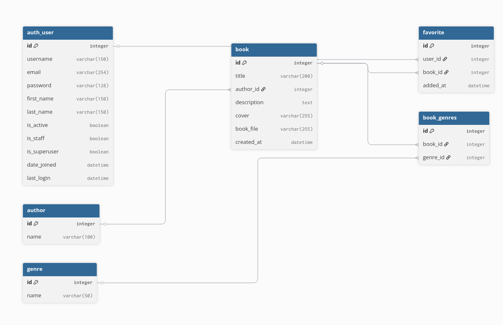
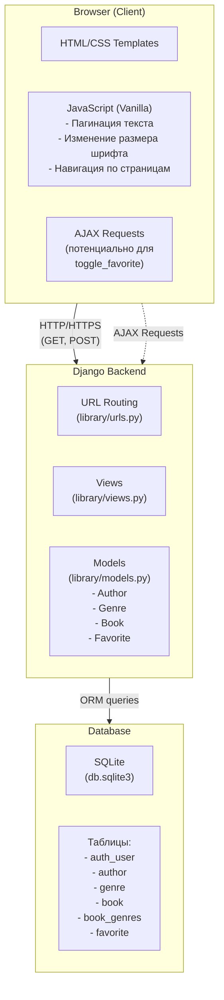

# Library_Django

Library_Django — это веб-приложение для управления библиотекой, разработанное на фреймворке Django. Проект предоставляет базовую функциональность для работы с каталогом книг и пользователями через веб-интерфейс.​

## Возможности

- Управление книгами: Добавление, редактирование, удаление книг.
- Управление пользователями: Регистрация читателей, профили.
- Аутентификация: Вход/регистрация через Django Authentication.
- Админ-панель: Полный CRUD через встроенную админку Django.

## Требования

- Python 3.8+
- Django 4.0+
- SQLite (по умолчанию) или PostgreSQL/MySQL
- Pillow (для обработки изображений обложек, если используется)

## Установка и запуск

1. Клонируйте репозиторий:
   
   ```
   git clone https://github.com/VasilevaNika/Library_Django.git
   cd Library_Django
   ```


2. Создайте виртуальное окружение и активируйте:
   
   ```
   python -m venv venv
   # Windows:
   venv\Scripts\activate
   # macOS/Linux:
   source venv/bin/activate
   ```


3. Установите зависимости:
   
   ```
   pip install django
   ```   


4. Выполните миграции и создайте суперпользователя:
   
   ```
   python manage.py makemigrations
   python manage.py migrate
   python manage.py createsuperuser
   ```


5. Запустите сервер разработки:
   
   ```
   python manage.py runserver
   ```

   Откройте [http://127.0.0.1:8000/](http://127.0.0.1:8000/)

## Структура проекта

```
Library_Django/
├── manage.py
├── online_library/          # Основное Django-приложение
│   ├── __init__.py
|   ├── asgi.py
│   ├── settings.py
│   ├── urls.py
│   └── wsgi.py
├── library/      # Приложение библиотеки
|   ├── __init__.py
│   ├── models.py     # Модели: Book, Author, Genre, Profile
│   ├── views.py      # Представления: списки, формы, CRUD
│   ├── urls.py
|   ├── admin.py
|   ├── apps.py
|   ├── forms.py
│   ├── templates/
│   └── migrations/
├── media/            # Загружаемые файлы: книги (pdf), обложки
└── db.sqlite3
```

## Использование
### Пользовательский интерфейс

- Основная страница: http://127.0.0.1:8000/
- Админ-панель: http://127.0.0.1:8000/admin/

### Админ-панель

После входа в админку доступно управление всеми моделями проекта (книги, авторы, пользователи).

### Скриншоты

Главная сраница приложения


Страница профиля пользователя


Страница каталога книг


### Схема базы данных (ER-диаграмма)



### Описание моделей проекта

**User** (auth_user) — пользователи онлайн-библиотеки (читатели), которые могут регистрироваться, авторизоваться, просматривать каталог книг, читать книги онлайн, добавлять книги в избранное и управлять своим профилем.

**Author** — авторы книг, используются для группировки произведений по автору, поиска книг конкретного автора и отображения информации об авторе на странице книги.

**Genre** — жанры книг (художественная литература, детективы, фантастика, романы, поэзия и т.д.), используются для категоризации каталога, фильтрации книг по жанрам и навигации по библиотеке.

**Book** — книга в каталоге библиотеки: название, автор, жанры (связь многие-ко-многим), описание, обложка, файл книги (PDF или текстовый формат для чтения онлайн) и дата добавления в библиотеку; используется для отображения в каталоге, детальной страницы книги и чтения онлайн.

**Favorite** — избранные книги пользователя: связь с пользователем и книгой, дата добавления в избранное; используется для личного кабинета пользователя, где отображается список сохранённых книг для быстрого доступа.

**book_genres** — промежуточная таблица для связи многие-ко-многим между книгами и жанрами, позволяет одной книге принадлежать нескольким жанрам одновременно (например, книга может быть одновременно детективом и триллером).


### Архитектура проекта



## Развертывание в продакшен

1. Установите DEBUG = False в settings.py
2. Настройте ALLOWED_HOSTS
3. Соберите статические файлы: python manage.py collectstatic
4. Используйте Gunicorn + Nginx или платформы Heroku/Render

## Работу выполнили

Над проектом работали студенты колледжа "Сириус" группы К0709-23/3: Васильева Ника, Кашапов Денис, Писарев Даниил.
